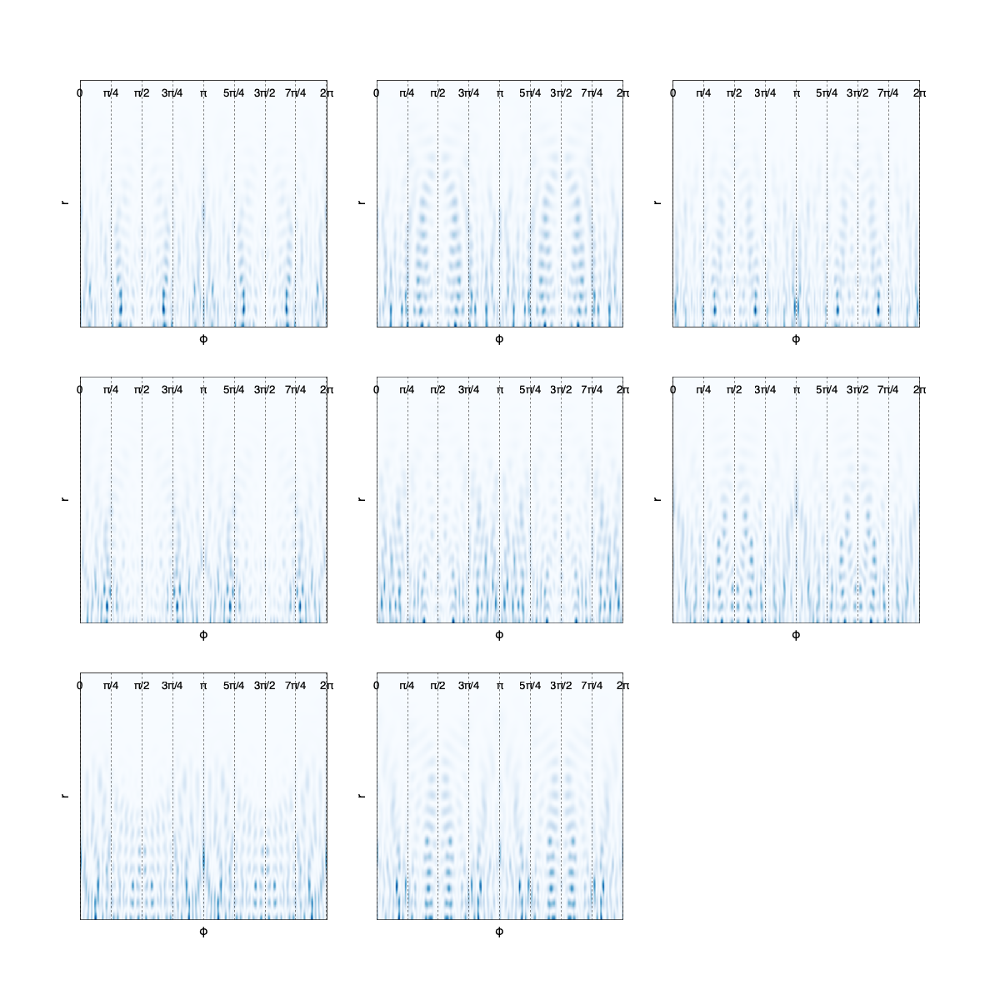

# Boundary Integral Method
***
This is a **WIP** C++ project for constructing the SVD (determinant) spectra with methods for getting the wavenumber solutions to the Helmholtz Kernel (altough a child class of the `IKernelStrategy` can be created that would incorporate a potential inside the boundary). 

**I would greatly appreciate any advice or assistance in continuous development of this project (I very much like collaboration)**.

Most of what is possible is given in main.cpp. In the main function of the file just uncomment a method and test it out! (some things that are there are from development not uploaded yet - ConformalMapping, ExpandedBIM...) The following tables gives the status of available things:
***
|            Header             | Status  |                                                  Problems / TODO                                                  |     
|:-----------------------------:|:-------:|:-----------------------------------------------------------------------------------------------------------------:|   
|         Boundary.hpp          |   OK    |                                                    No problems                                                    |
|            BIM.hpp            | Semi-OK | New discretizations **need** be implemented, currently homogenous and curvature based quadratures are implemented |
| EigenfunctionsAndPLotting.hpp |   OK    |                          Perhaps adding new logic to the Poincare-Husimi functions (m>0)                          |
|   QuantumAnalysisTools.hpp    | Semi-OK |                   Correcting the number variance and spectral rigidity -> moving average error                    |

#### Implemented Boundaries:
* Rectangle
* Quarter-Rectangle
* Circle
* Quarter-Circle
* Ellipse
* Half-Ellipse
* Prosen Billiard
* Robnik Billiard
* Polygon Billiard (list of vertices needed) **Currently do not use due to corner problems
* Bunimovich Stadium
* Quarter-Bunimovich Stadium
* Mushroom **Currently do not use due to corner problems
* Half-Mushroom **Currently do not use due to corner problems

#### Constructing your own boundary

Below is an example of how to construct and check the boundary. Please check the `Boundary.hpp`'s examples of boundaries and how they are constructed. Almost all of them are an instances of `CompositeBoundary` with `QuarterCircle`s and `LineSegment`s (check how the rectangle and stadium is constructed) or an instance of ParametricBoundary (check the Robnik/Prosen billiard classes for further logic)

***
* Currently only the boundaries **without** holes are supported
* Boundaries with sharp corners need to be checked with a wavefunction density plot since due to discretization of points the solution might be wrong (I have instances below for the rectangle)

### TODOs:
* Expanded Boundary Integral method as per Veble's original paper. **Help or feedback much appreciated**.
* Classical Billiards. I already have a version semi-working, but the problem of trajectories going out of bounds remain. **Help or feedback much appreciated**.
* Conformal-Mapping. Checking the gsl integration statuses for general `a(r,phi)`. Will soon be uploaded.

#### Comment: Vergini-Saraceno will not be implemented, there is a dedicated library for that method written in Julia! [Vergini-Saraceno](https://github.com/clozej/QuantumBilliards.jl)
***

## Logic for constructing the BIM instance

### 1. Create a boundary

The boundary is constructed from a child class of the AbstractBoundary virtual class (check examples for concrete cases, as it gives insight on how to construct a custom boundary). An example of how to plot the billiard boundary is given below (only the boundary shared pointer instance will go into the BIM class constructor, other code is just for plotting the boundary to check correctnes):

```C++
#include "Boundary.hpp

double eps = 0.9; // The Robnik billiard parameter
const auto robnik = std::make_shared<RobnikBilliard>(eps); // Create a shared pointer to the boundary (needs to be a child class of Abstractboundary since the BIM constructor needs it)
std::cout << "Robnik Boundary Info" << std::endl;
robnik->printBoundaryInfo(50); // Prints the (x,y) coords, normals, arclenghts and parametrizations
const auto figRob = figure(true); // Uses matplot++ to plot the boundary
const auto axRob = figRob->add_axes(); // Create an axis to plot into
// Calculate the bounding box to set the limits
double minX, maxX, minY, maxY; // Variables to store limits of the boundary
robnik->getBoundingBox(minX, maxX, minY, maxY); // Populates the limit variables

// Plotting params so that it looks nice
xRange = maxX - minX; // This is for centering the plot
yRange = maxY - minY; // This is for centering the plot
xCenter = (maxX + minX) / 2.0; // Finds the center
yCenter = (maxY + minY) / 2.0; // Finds the center
limit = 1.2 * std::max(xRange, yRange); // Some margins such that the boudnary limits will not be plotted right by the end of the axis

axRob->xlim({xCenter - limit / 2.0, xCenter + limit / 2.0});
axRob->ylim({yCenter - limit / 2.0, yCenter + limit / 2.0});
axRob->axes_aspect_ratio(1.0); // Change is the geometry of the object is different coordinate wise in x,y directions (like an elongated ellipse would need to change the aspect ratio to look nice)
robnik->plot(axRob, 50, true, true); // Plot the boundary into the axis
show(); // show the figure to the screen
```


This plots the Robnik billiard with 50 points `robnik->plot(axRob, 50, true, true)`. The additional kwargs plot the normals and the coordinate system axes. This is an example of a `ParametricBoundary` which is constructed from a `r(t)=x(t),y(t)`.

**For explicit construction of the Robnik billiard under the hood please check the Boundary.hpp header. All the example boundaries are there with insight how to create your own!**.

Here is an example of a `CompositeBoundary` instance constructed from `LineSegment`s and a `ParametricBoundary`, the square with parabolic top:


### 2. Choosing an IKernelStrategy child class

Once a the child class of `AbstractBoundary` is constructed we need to create an intgration strategy. This is responsible for populating the Fredholm matrix with the correct functional form for a given boundary. The options are the following:

* `IKernelStrategy`: Abstract base class for kernel computation strategies.
* `DefaultKernelIntegrationStrategy`: Default integration strategy without symmetry considerations** -> this is the one used for full boundaries (non-desymmetrized)
* `XReflectionSymmetryDStandard`: Dirichlet boundary condition with X reflection symmetry (standard) -> check half-rectangle with x reflection symmetry example.
* `XReflectionSymmetryNStandard`: Neumann boundary condition with X reflection symmetry (standard).
* `YReflectionSymmetryDStandard`: Dirichlet boundary condition with Y reflection symmetry (standard) -> check half-rectangle with y reflection symmetry example.
* `YReflectionSymmetryNStandard`: Neumann boundary condition with Y reflection symmetry (standard).
* `XYReflectionSymmetryNNStandard`: Neumann-Neumann boundary conditions with XY reflection symmetry (standard) -> check the quarter circle example
* `XYReflectionSymmetryStandardDD`: Dirichlet-Dirichlet boundary conditions with XY reflection symmetry (standard).
* `XYReflectionSymmetryStandardND`: Neumann-Dirichlet boundary conditions with XY reflection symmetry (standard).
* `XYReflectionSymmetryStandardDN`: Dirichlet-Neumann boundary conditions with XY reflection symmetry (standard).
* `C3SymmetryDStandard`: Dirichlet boundary condition with C3 rotational symmetry (standard).
* `C3SymmetryNStandard`: Neumann boundary condition with C3 rotational symmetry (standard).

The boundary is then created as described below. The only input it takes is the shared pointer to the boundary. Please see the examples to have a clearer understanding about the construction:

```C++
#include "Boundary.hpp
#include "KernelIntegrationStrategy.hpp

double eps = 0.9; // The Robnik billiard parameter
const auto robnik = std::make_shared<Boundary::RobnikBilliard>(eps);
const auto kernel = std::make_Shared<KernelIntegrationStrategy::DefaultKernelIntegrationStrategy>(robnik);
```

These are just the non-beta version of the classes. Beta variation is a procedure where one varies the "beta" parameter in the integration kernel to see if any local minimas in the resulting specter change (the hunt for spurious solutions). One can use it but I have not made any examples of it. I checked some but the local minimas did not shift, as the beta variation is used when we have holes in the interior of the boundary.

### 2. Create a KRangeSolver class with the boundary 

With a child class of `AbstractBoundary` and `IKernelStrategy` we construct the BIM class by constructing the `KRangeSolver` class. This is a wrapper of the base `BoundaryIntegral` class that constructts it for each `k` in a given interval `[k_min, k_max]` with a given number of grid points (`SIZE_K`) in this k-scale. The `scalingFactor` determines based on a given `k` the number of points to discretize the curve. A typical choice is 10-15 based on the complexity of the geometry.

Below is an example of how the KRangeSolver is constructed and how the SVD plot is constructed. The only thing that varies between different boundaries and integration strategies is the y-limits (the svd values) and the threshold for the smallest local minima and the threshold between the local minima.

#### Comment: Please read the header `BIM.hpp` file docstrings for the `plotSmallestSingularValues` and `plotSingularValues` methods as to know how to set the limits of plotting

```C++
constexpr double eps = 0.9;
const auto robnik = std::make_shared<Boundary::RobnikBilliard>(eps);
const auto kernelStrategy = std::make_shared<KernelIntegrationStrategies::DefaultKernelIntegrationStrategy>(robnik);

// KRangeSolver parameters
constexpr double k_min = 40.0;
constexpr double k_max = 41.0;
constexpr int SIZE_K = 200000;
constexpr int scalingFactor = 15;

// Create and use the KRangeSolver
BIM::KRangeSolver solver(k_min, k_max, SIZE_K, scalingFactor, robnik, kernelStrategy);
solver.computeSingularValueDecomposition(Eigen::ComputeThinU);

// Plotting
const auto fig = figure(true);
fig->size(1000, 800);
const auto ax = fig->add_subplot(2, 1, 1);
const auto ax2 = fig->add_subplot(2, 1, 2);

solver.plotSmallestSingularValues(ax, -0.1, 1);
solver.plotSmallestSingularValues(ax2, -0.01, 0.07);

solver.plotSingularValues(ax, 2, -0.1, 1);
solver.plotSingularValues(ax2, 2, -0.01, 0.07);

solver.plotSingularValues(ax, 3, -0.1, 1);
solver.plotSingularValues(ax2, 3, -0.01, 0.07);

solver.plotSingularValues(ax, 4, -0.1, 1);
solver.plotSingularValues(ax2, 4, -0.01, 0.07);

hold(ax, on);
// Add dashed line at y = 0 in both ax and ax2
ax->plot({k_min, k_max}, {0.0, 0.0}, "k--");
hold(ax2, on);
ax2->plot({k_min, k_max}, {0.0, 0.0}, "k--");

matplot::legend(ax, true);
matplot::legend(ax2, true);

solver.printLocalMinimaOfSingularValues(0.2);
const std::string nameFile = "Robnik_Billiard_kmin_" + std::to_string(k_min) +  "_kmax_" + std::to_string(k_max) + ".png";
save(fig, nameFile);
```

Here is the resulting SVD plot from running the code:


#### 2.1 Desymmetrized Billiards

THe non-default kernels stated above offer a way to only input the desymmetrized boundary into the kernel integration strategy class input. For this one needs to choose the correct kernel based on the symmetry e.g. for a boundary with an x axis symmetry do not choose on which has the y axis symmetry. There is currently no error handling implemented for this.

Below is an example of a desymmetrized circle (`QuarterCircle`) that has Neumann-Neumann boundary conditions on the symmetry lines.

```C++
#include "Boundary.hpp
#include "BIM.hpp"
#include "KernelIntegrationStrategy.hpp"
#include "QuantumAnalysisTools.hpp"

using namespace BIM;
double radius = 1.0;
Point center(0.0, 0.0);
auto circleBoundary = std::make_shared<QuarterCircle>(center, radius, Point{1.0,0.0});

// Define the desymmetrized kernel strategy (Neumann-Neumann)
const auto kernelStrategy = std::make_shared<XYReflectionSymmetryNNStandard>(circleBoundary);
// KRangeSolver parameters
constexpr double k_min = 0.5;
constexpr double k_max = 20.0;
constexpr int SIZE_K = 200000;
constexpr int scalingFactor = 10;

// Create and use the KRangeSolver
KRangeSolver solver(k_min, k_max, SIZE_K, scalingFactor, circleBoundary, kernelStrategy);

// Compute the singular values
solver.computeSingularValueDecomposition(Eigen::ComputeThinU);
solver.printLocalMinimaOfSingularValues(0.1);
auto localMinima = solver.findLocalMinima(0.15); // Threshold for finding the local minima, set very high as I did not want to find the optimal one

// Analytical eigenvalues using GSL for Bessel function zeros
std::vector<std::tuple<double, int, int>> analytical_eigenvalues = computeCircleAnalyticalEigenvalues(k_min, k_max, radius);

// Calculate and print the differences between numerical and analytical eigenvalues
std::cout << "\nDifferences between numerical and analytical k values:\n";
for (const auto& [numerical_k, smallest_singular_value] : localMinima) {
    // Find the closest analytical eigenvalue
    auto closest_analytical = *std::ranges::min_element(analytical_eigenvalues, [numerical_k](const auto& a, const auto& b) {
 return std::abs(std::get<0>(a) - numerical_k) < std::abs(std::get<0>(b) - numerical_k);});

    double closest_analytical_k = std::get<0>(closest_analytical);
    int nu = std::get<1>(closest_analytical);
    int zero_index = std::get<2>(closest_analytical);

    double absolute_difference = std::abs(numerical_k - closest_analytical_k);
    double relative_difference = absolute_difference / closest_analytical_k;

    if (smallest_singular_value < 0.2) {
        std::cout << "Numerical k: " << numerical_k
              << ", Analytical k: " << closest_analytical_k
              << " (k: " << nu << ", l: " << zero_index << ")"
              << ", Smallest Singular Value: " << smallest_singular_value
              << ", Absolute Difference: " << absolute_difference
              << ", Relative Difference: " << relative_difference << std::endl;
    }
}

const auto fig = figure(true);
fig->size(1800, 1200);
const auto ax = fig->add_subplot(1, 1, 1);
// Plots the smallest singular values into the axis
solver.plotSmallestSingularValues(ax, -0.05, 0.5);

// Plot analytical solutions as purple diamonds
const std::vector<double> analytical_x(analytical_eigenvalues.size(), 0);
std::vector<double> analytical_k_values;
analytical_k_values.reserve(analytical_eigenvalues.size());
for (const auto& [k_mn, nu, zero_index] : analytical_eigenvalues) {
    analytical_k_values.push_back(k_mn);
}
const auto l = ax->scatter(analytical_k_values, analytical_x);
l->display_name("Analytical");
l->marker_style(line_spec::marker_style::diamond);
l->marker_size(15);
l->marker_color("purple");

// Add vertical dashed asymptotes at analytical k values
for (const auto& [k_mn, nu, l] : analytical_eigenvalues) {
    if (nu % 2 == 0) {
        ax->plot({k_mn, k_mn}, {ax->y_axis().limits().at(0), ax->y_axis().limits().at(1)}, "k--");
        // Add label for (nu,l) parallel to the dashed line
        double offset_y;
        if ((nu / 2) % 2 == 0) {
            offset_y = ax->y_axis().limits().at(1) * 0.95; // Slightly below the top of the y-axis
        } else {
            offset_y = ax->y_axis().limits().at(1) * 0.75; // Slightly more below the top of the y-axis
        }
        auto txt = ax->text(k_mn, offset_y, "(" + std::to_string(nu) + "," + std::to_string(l) + ")");
        txt->font_size(10);
        txt->color("black");
    }
}

// Add labels for (k,l) pairs below the diamonds in ax2
for (const auto& [k_mn, nu, zero_index] : analytical_eigenvalues) {
    double offset_y = (nu % 2 == 0) ? 0.02 : -0.02; // Alternate offset for even and odd values
    if (nu == 0) {
        offset_y *= 2;
    }
    auto txt = ax->text(k_mn, offset_y, "(" + std::to_string(nu) + "," + std::to_string(zero_index) + ")");
    txt->font_size(10);
    if (nu == 0) {
        txt->color("red");
    } else {
        txt->color("black");
    }
}
matplot::legend(ax, false);
save(fig, "Quarter_Circle_SVD_NN.png");
show();
```

The above code gives the following SVD plot below. The nu = odd local minima are not present giving consistency with the allowed results
#### Comment / Bug: There are artifacts apparent in the SVD plot of the desymmetrization procedure for the (0,*) local minima. This decreases with the increasing number of discretization points. Would greatly appreciate any insight on how to get rid of this


### 3. Plot the Eigenfunctions -> `EigenfuntionsAndPLotting` class

The `EigenfunctionAndPlotting` class is located in the `Plotting.hpp` header file. It is concerned with various plots (like the Angular and Radially integrated density, the Momentum density plot, the Poincare-Husimi scar representation calculation). Most of this was coded in accordance with the derivations of Bäcker et.al.

The logic is that we:

1. Construct an instance of the child class of AbstractBoundary -> here RobnikBilliard
2. Make the instance of the child class of IKernelStrategy -> here DefaultKernelIntegrationStrategy as we took no symmetrries into account
3. Creating a figure_handle and the number of axis_handles that we need for plotting the wavefunction densities
4. For each k we get from the KRangeSolver class we create a BoundaryIntegral class that we feed to the EigenfunctionsAndPlotting class

##### Here we take the resulting SVD plot from above an  extract some of its's local minima for the smallest singular value:
```C++
#include "Boundary.hpp"
#include "BIM.hpp"
#include "KernelIntegrationStrategy.hpp"

constexpr double eps = 0.9;
const auto robnik = std::make_shared<Boundary::RobnikBilliard>(eps);
const auto kernelStrategy = std::make_shared<KernelIntegrationStrategies::DefaultKernelIntegrationStrategy>(robnik);
const auto fig = matplot::figure(true);
fig->size(1500, 1500);
const auto fig2 = matplot::figure(true);
const auto ax1 = fig->add_subplot(3, 3, 0);
const auto ax2 = fig->add_subplot(3, 3, 1);
const auto ax3 = fig->add_subplot(3, 3, 2);
const auto ax4 = fig->add_subplot(3, 3, 3);
const auto ax5 = fig->add_subplot(3, 3, 4);
const auto ax6 = fig->add_subplot(3, 3, 5);
const auto ax7 = fig->add_subplot(3, 3, 6);
const auto ax8 = fig->add_subplot(3, 3, 7);

BIM::BoundaryIntegral bi1(40.0015000300005994, 15, robnik, kernelStrategy);
const EigenfunctionsAndPlotting plotting1(bi1,  1);
BIM::BoundaryIntegral bi2(40.9039380787615769, 15, robnik, kernelStrategy);
const EigenfunctionsAndPlotting plotting2(bi2,  1);
BIM::BoundaryIntegral bi3(40.9444388887777748, 15, robnik, kernelStrategy);
const EigenfunctionsAndPlotting plotting3(bi3,  1);
BIM::BoundaryIntegral bi4(40.9823796475929498, 15, robnik, kernelStrategy);
const EigenfunctionsAndPlotting plotting4(bi4,  1);
BIM::BoundaryIntegral bi5(40.7830589152945748, 15, robnik, kernelStrategy);
const EigenfunctionsAndPlotting plotting5(bi5,  1);
BIM::BoundaryIntegral bi6(40.7111885559427833, 15, robnik, kernelStrategy);
const EigenfunctionsAndPlotting plotting6(bi6,  1);
BIM::BoundaryIntegral bi7(40.6741083705418518, 15, robnik, kernelStrategy);
const EigenfunctionsAndPlotting plotting7(bi7,  1);
BIM::BoundaryIntegral bi8(40.4952324761623785, 15, robnik, kernelStrategy);
const EigenfunctionsAndPlotting plotting8(bi8,  1);
plotting1.plotWavefunctionDensityHeatmap(ax1, 500, 500, 1.0, 0, true, true);
plotting2.plotWavefunctionDensityHeatmap(ax2, 500, 500, 1.0, 0, true, true);
plotting3.plotWavefunctionDensityHeatmap(ax3, 500, 500, 1.0, 0, true, true);
plotting4.plotWavefunctionDensityHeatmap(ax4, 500, 500, 1.0, 0, true, true);
plotting5.plotWavefunctionDensityHeatmap(ax5, 500, 500, 1.0, 0, true, true);
plotting6.plotWavefunctionDensityHeatmap(ax6, 500, 500, 1.0, 0, true, true);
plotting7.plotWavefunctionDensityHeatmap(ax7, 500, 500, 1.0, 0, true, true);
plotting8.plotWavefunctionDensityHeatmap(ax8, 500, 500, 1.0, 0, true, true);
EigenfunctionsAndPlotting::arrangeAxesInFigure(fig, {ax1, ax2, ax3, ax4, ax5, ax6, ax7, ax8}, 3, 3, 0.005, 0.005);
save(fig, "robnik_40_41_more.png");
```

This provides 8 plots of the wavefunction densities. Please take note of the fact that this has a problematic point on (-*,0) on the x-axis (for plots #3, #5). **For the sake of transparency I plot also the wavefunction outside the boundary as that is also a marker that it's working as intended (or at least within the line it is supposed to)**. It goes without saying that plots such as #3,#5 have a higher non-zero wavefunction value on the boundary around that point. The same problem exists for the Rectangle. This will need to be addressed.


#### 3.1 Plotting Poinare-Husimi

Here is the m=0 Poincare-Husimi code for the wavefunction densities above with the corresponding code (the `BoundaryIntegral` instances are the same as for the wavefunction densities)

```C++
#include "Boundary.hpp"
#include "BIM.hpp"
#include "KernelIntegrationStrategy.hpp"

constexpr double eps = 0.9;
const auto robnik = std::make_shared<Boundary::RobnikBilliard>(eps);
const auto kernelStrategy = std::make_shared<KernelIntegrationStrategies::DefaultKernelIntegrationStrategy>(robnik);

const auto fig2 = matplot::figure(true);
fig2->size(1000, 1000);
const auto ax12 = fig2->add_subplot(3, 3, 0);
const auto ax22 = fig2->add_subplot(3, 3, 1);
const auto ax32 = fig2->add_subplot(3, 3, 2);
const auto ax42 = fig2->add_subplot(3, 3, 3);
const auto ax52 = fig2->add_subplot(3, 3, 4);
const auto ax62 = fig2->add_subplot(3, 3, 5);
const auto ax72 = fig2->add_subplot(3, 3, 6);
const auto ax82 = fig2->add_subplot(3, 3, 7);

BIM::BoundaryIntegral bi1(40.0015000300005994, 15, robnik, kernelStrategy);
const EigenfunctionsAndPlotting plotting1(bi1,  1);
BIM::BoundaryIntegral bi2(40.9039380787615769, 15, robnik, kernelStrategy);
const EigenfunctionsAndPlotting plotting2(bi2,  1);
BIM::BoundaryIntegral bi3(40.9444388887777748, 15, robnik, kernelStrategy);
const EigenfunctionsAndPlotting plotting3(bi3,  1);
BIM::BoundaryIntegral bi4(40.9823796475929498, 15, robnik, kernelStrategy);
const EigenfunctionsAndPlotting plotting4(bi4,  1);
BIM::BoundaryIntegral bi5(40.7830589152945748, 15, robnik, kernelStrategy);
const EigenfunctionsAndPlotting plotting5(bi5,  1);
BIM::BoundaryIntegral bi6(40.7111885559427833, 15, robnik, kernelStrategy);
const EigenfunctionsAndPlotting plotting6(bi6,  1);
BIM::BoundaryIntegral bi7(40.6741083705418518, 15, robnik, kernelStrategy);
const EigenfunctionsAndPlotting plotting7(bi7,  1);
BIM::BoundaryIntegral bi8(40.4952324761623785, 15, robnik, kernelStrategy);
const EigenfunctionsAndPlotting plotting8(bi8,  1);

plotting1.plotPoincareHusimiHeatmap(ax12, 500, 1.0);
plotting2.plotPoincareHusimiHeatmap(ax22, 500, 1.0);
plotting3.plotPoincareHusimiHeatmap(ax32, 500, 1.0);
plotting4.plotPoincareHusimiHeatmap(ax42, 500, 1.0);
plotting5.plotPoincareHusimiHeatmap(ax52, 500, 1.0);
plotting6.plotPoincareHusimiHeatmap(ax62, 500, 1.0);
plotting7.plotPoincareHusimiHeatmap(ax72, 500, 1.0);
plotting8.plotPoincareHusimiHeatmap(ax82, 500, 1.0);

EigenfunctionsAndPlotting::arrangeAxesInFigure(fig2, {ax12, ax22, ax32, ax42, ax52, ax62, ax72, ax82}, 3, 3, 0.005, 0.005);
save(fig2, "robnik_40_41_more_husimi.png");
```


The normal derivatives of the wavefunctions above (change the code `.plotPoincareHusimiHeatmap` method with the one below):

```C++
plotting1.plotNormalDerivativeOfWavefunction(ax12, 0, 1.0, false);
plotting2.plotNormalDerivativeOfWavefunction(ax22, 0, 1.0, false);
plotting3.plotNormalDerivativeOfWavefunction(ax32, 0, 1.0, false);
plotting4.plotNormalDerivativeOfWavefunction(ax42, 0, 1.0, false);
plotting5.plotNormalDerivativeOfWavefunction(ax52, 0, 1.0, false);
plotting6.plotNormalDerivativeOfWavefunction(ax62, 0, 1.0, false);
plotting7.plotNormalDerivativeOfWavefunction(ax72, 0, 1.0, false);
plotting8.plotNormalDerivativeOfWavefunction(ax82, 0, 1.0, false);
```

The normal derivatives of the wavefunctions above (change the code `.plotPoincareHusimiHeatmap` method with the one below):

```C++
plotting1.plotNormalDerivativeOfWavefunction(ax12, 0, 1.0, false);
plotting2.plotNormalDerivativeOfWavefunction(ax22, 0, 1.0, false);
plotting3.plotNormalDerivativeOfWavefunction(ax32, 0, 1.0, false);
plotting4.plotNormalDerivativeOfWavefunction(ax42, 0, 1.0, false);
plotting5.plotNormalDerivativeOfWavefunction(ax52, 0, 1.0, false);
plotting6.plotNormalDerivativeOfWavefunction(ax62, 0, 1.0, false);
plotting7.plotNormalDerivativeOfWavefunction(ax72, 0, 1.0, false);
plotting8.plotNormalDerivativeOfWavefunction(ax82, 0, 1.0, false);
```


And the momentum distributions. The bottom of the r-axis is where the maximum is located (at the k where the `BoundaryIntegral` was taken, and the upper part is k=0). The x-axis represent the angle dependence of the momentum



### Some examples of how the SVD plot should look like

#### Rectangle 
The (m,n) pairs are the quantum numbers describing the solution of the rectangle (the x and y direction natural number multiples).
Comment: The yellow star mark indicates missing theoretical levels. The second smallest singular value (the red line) captures the doublet degeneracy


#### Circle

The (m,n) pairs are the quantum numbers describing the solution of the circle (the radial and angular quantum numbers). Due to the number of them the labels are merged a bit.


Here is also a cleaner one from k=10 to k=15.5. It also shows that at around 11.08 we must be careful with the two doublet proximities as with a wrong tolerance for triplets it could flag this as a multiplet


#### Prosen Billiard


### 4 Analysis of Data

**Upcoming**. I would like to make working versions of the number variance and spectral rigidity before finishing this.

### 5 Corner Problems

I would greatly appreciate helpful feedback on how to handle corners effectively (taking into account the limitations of this codebase). Currently I use discretization of points based on the angle difference between the normals of the boundary, since the curvature for polygons is 0 and offers no insight. The jumps in angle difference is smoothed using the `gsl_spline` method and then integrated to give a CDF function that redistributes the points. But as previously stated, I would require some help in this regard


